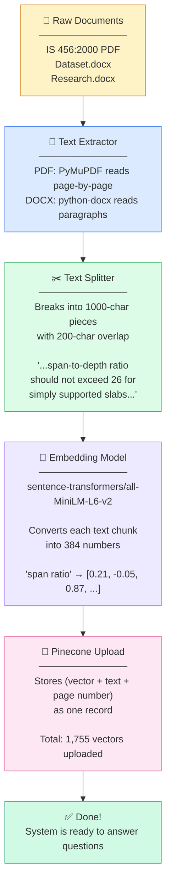
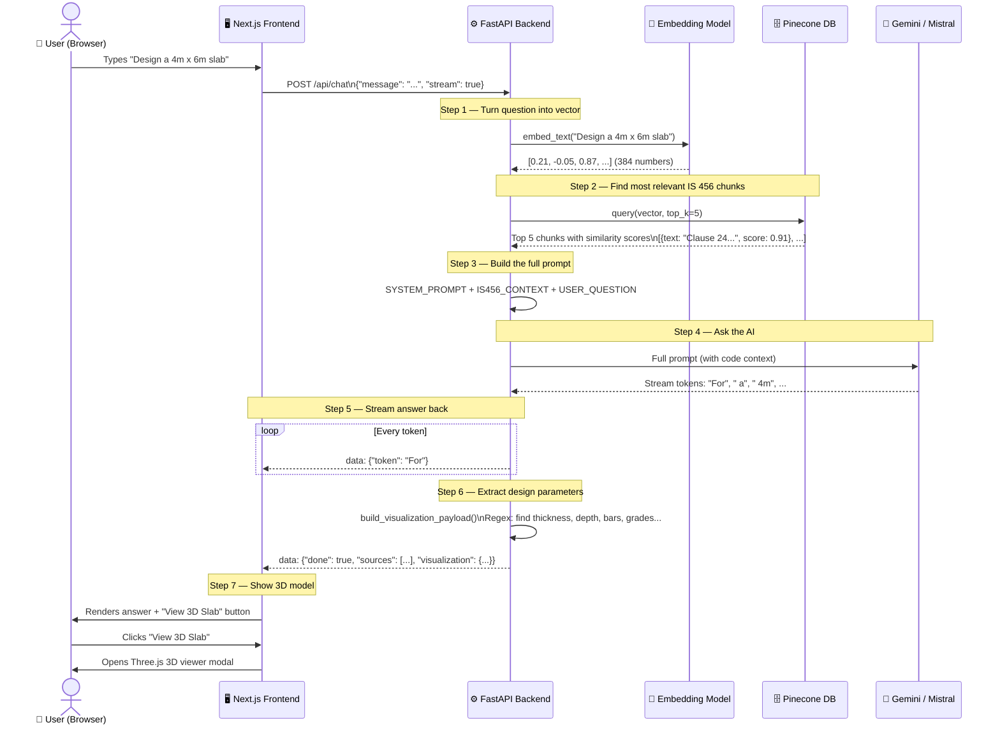
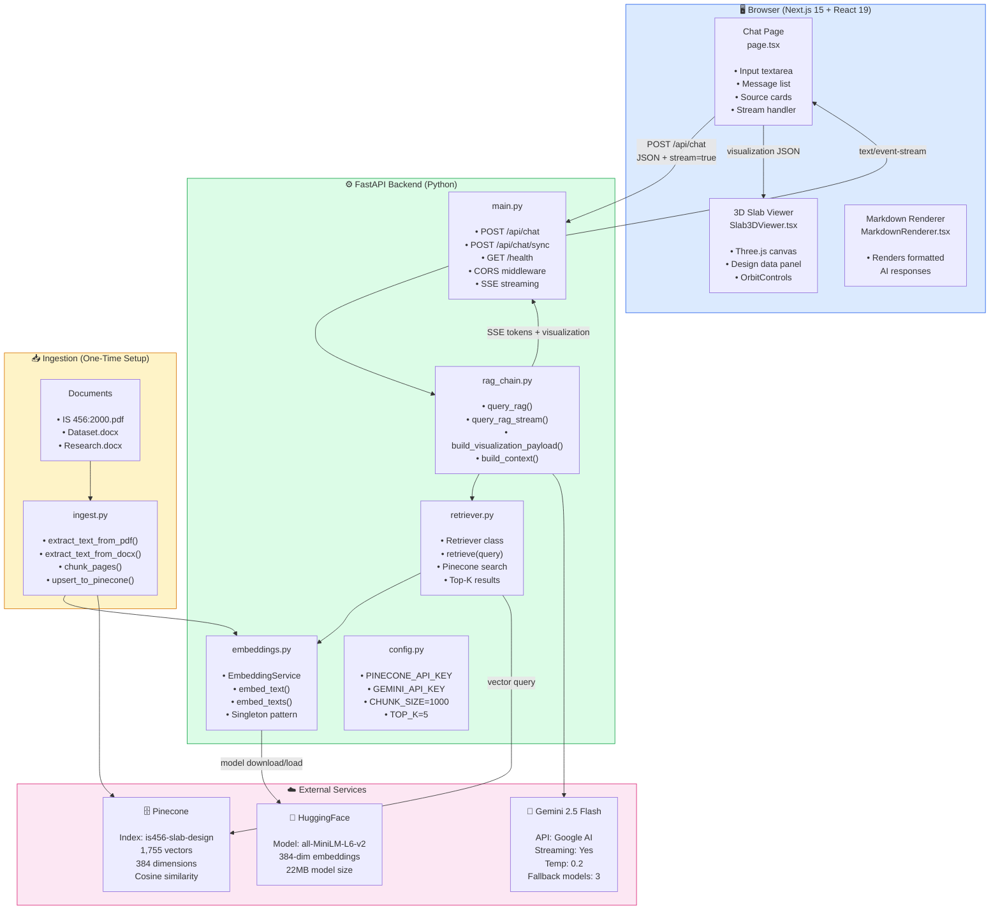
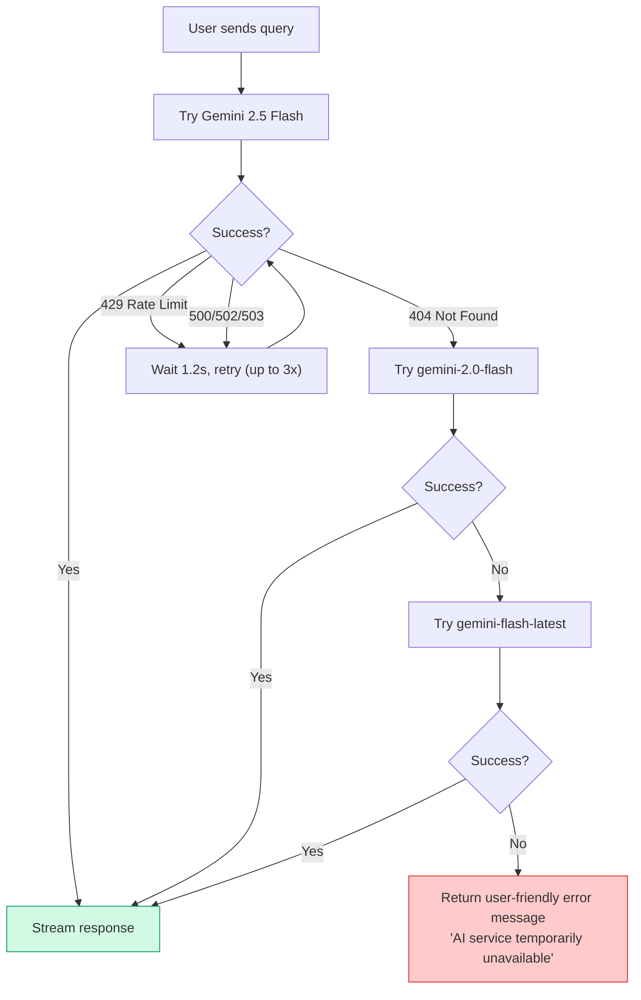

# Smart Civilian — How It All Works
### A Visual Deep-Dive: From a 5-Year-Old's Perspective to Engineer-Level Detail

---

## The Big Idea in One Sentence

> **Smart Civilian is like a super-smart friend who has read the entire IS 456:2000 rulebook for building concrete floors, can answer any question about it, AND draws you a 3D picture of the floor you designed.**

---

## 🧒 Explain It Like I'm 5

Imagine you want to build a concrete floor (called a **slab**) in a house.

```
┌─────────────────────────────────────────────────────────────────┐
│                                                                 │
│   YOU:  "How thick should my floor be if my room is 4m wide?"  │
│                                                                 │
│         ┌──────────────┐                                        │
│         │   📚 The AI  │ ← Has read THE ENTIRE RULEBOOK        │
│         │   Friend     │   (IS 456:2000, 174 pages!)            │
│         └──────┬───────┘                                        │
│                │                                                │
│   AI FRIEND:  "The rulebook says your floor should be          │
│                160mm thick, use M25 concrete, and put          │
│                10mm steel bars every 180mm!"                   │
│                                                                 │
│                   ┌──────────────────┐                         │
│                   │  🧊 3D PICTURE   │  ← Also draws it!       │
│                   │  of your floor   │                         │
│                   └──────────────────┘                         │
└─────────────────────────────────────────────────────────────────┘
```

**The trick:** The AI doesn't just *guess* — it finds the EXACT relevant pages from the rulebook before answering. That's the **RAG** magic.

---

## 🗺️ The Entire System at a Glance

```
╔══════════════════════════════════════════════════════════════════════════╗
║                      SMART CIVILIAN SYSTEM MAP                          ║
╠══════════════════════════════════════════════════════════════════════════╣
║                                                                          ║
║   ┌─────────────┐     ┌──────────────────┐     ┌────────────────────┐  ║
║   │  📄 BOOKS   │     │  🧠 AI BRAIN     │     │   👤 YOU           │  ║
║   │             │     │                  │     │                    │  ║
║   │ IS 456:2000 │     │  Gemini / Mistral│     │  Web Browser       │  ║
║   │ Dataset.docx│────▶│  (Generates the  │◀───▶│  (Chat UI)         │  ║
║   │ Research.   │     │   answers)       │     │  (3D Viewer)       │  ║
║   │ docx        │     │                  │     │                    │  ║
║   └──────┬──────┘     └──────────────────┘     └────────────────────┘  ║
║          │                      ▲                                        ║
║          │ (Stored as           │ (Relevant pages                       ║
║          │  number vectors)     │  fetched instantly)                   ║
║          ▼                      │                                        ║
║   ┌─────────────────────────────┴──────────────────────────────────┐    ║
║   │                   🗄️ PINECONE DATABASE                         │    ║
║   │          (Stores 1,755 chunks as 384-number vectors)           │    ║
║   └────────────────────────────────────────────────────────────────┘    ║
║                                                                          ║
╚══════════════════════════════════════════════════════════════════════════╝
```

---

## Phase 1: The One-Time Setup — "Teaching the System"

This happens **once**, before any user ever asks a question.

### Step-by-Step: How Documents Become Searchable



### Why "Overlap" in Chunking?

```
THE ORIGINAL TEXT:
─────────────────────────────────────────────────────────────
"...the effective span shall be taken as the smaller of (a) the
distance between centers of bearings or (b) the clear span plus
the effective depth of the beam or slab..."
─────────────────────────────────────────────────────────────

CHUNK 1 (characters 0-1000):
┌──────────────────────────────────────────────────────────┐
│ "...the effective span shall be taken as the smaller of  │
│ (a) the distance between centers of bearings or (b) the  │
│ clear span plus the effective depth of..."               │
└──────────────────────────────────────────────────────────┘

OVERLAP (characters 800-1000 repeated in Chunk 2):        ←── This is the BRIDGE
┌──────────────────────────────────────────────────────────┐
│           [200 chars from end of Chunk 1]                │
│ "...clear span plus the effective depth of the beam or   │
│ slab... Clause 22.2 also states that for flat slabs..."  │
└──────────────────────────────────────────────────────────┘

WHY? So no sentence gets cut in half and loses its meaning!
```

### What a "Vector" (Embedding) Really Is

```
A chunk of text is converted to 384 numbers.
Similar meaning = similar numbers = close in space.

              ↑ (dimension 2)
              │
   "slab      │      "floor
   thickness" ●        depth"
              │    ●
              │
              │                    ● "cooking
              │                       recipe"
              ──────────────────────────────────→ (dimension 1)

NEARBY = SIMILAR MEANING ✓
FAR AWAY = DIFFERENT TOPIC ✗

Pinecone stores all 1,755 of these "coordinate points"
and finds the closest ones to your question instantly!
```

---

## Phase 2: Every Query — "The Live Pipeline"

This happens **every time a user asks a question**.

### The Full Journey of One Question



---

## Zoomed In: The RAG Magic

**RAG = Retrieval-Augmented Generation**

```
WITHOUT RAG (Normal ChatGPT):                WITH RAG (Smart Civilian):
─────────────────────────────────────        ────────────────────────────────────
                                             
User: "What's the minimum clear            User: "What's the minimum clear
       cover for a slab?"                         cover for a slab?"
                                             
AI: "Hmm, I think it's around 15mm?"       Step 1: Find relevant IS 456 pages
     (Maybe wrong. Hallucinating!)                  [Chunk: "Clause 26.4.1 states...
                                                     nominal cover ≥ 20mm for
                                                     mild exposure..."]
                                             
                                             Step 2: Answer WITH that proof:
                                             AI: "Per IS 456:2000 Clause 26.4.1,
                                                  minimum clear cover is 20mm for
                                                  mild exposure conditions."
                                                  (Cited! Trustworthy!)

┌─────────────────────────────────────────────────────────────────────────┐
│  RAG = "Look it up FIRST, THEN answer" vs "Answer from memory"         │
└─────────────────────────────────────────────────────────────────────────┘
```

### How Pinecone Finds the Right Chunks

```
USER QUESTION: "what is the span to depth ratio for one way slab?"

Step 1: Question → Vector
┌────────────────────────────────────────────────────────┐
│  [0.14, 0.67, -0.22, 0.88, 0.03, -0.51, ... ]         │
│                          (384 numbers)                 │
└────────────────────────────────────────────────────────┘

Step 2: Compare against ALL 1,755 stored vectors
        (Pinecone does this in ~200ms using cosine similarity)

Cosine Similarity = How "pointed in the same direction" are two vectors
                    Score of 1.0 = identical meaning
                    Score of 0.0 = completely unrelated

Results:
╔══════╦══════════════════════════════════════════════╦═══════╗
║ Rank ║ Chunk Preview                                ║ Score ║
╠══════╬══════════════════════════════════════════════╬═══════╣
║  1   ║ "...span to effective depth ratio for        ║ 0.921 ║
║      ║  simply supported one-way slabs shall        ║       ║
║      ║  not exceed 20 (Clause 23.2.1)..."           ║       ║
╠══════╬══════════════════════════════════════════════╬═══════╣
║  2   ║ "...for continuous slabs the ratio may       ║ 0.887 ║
║      ║  be increased to 26..."                      ║       ║
╠══════╬══════════════════════════════════════════════╬═══════╣
║  3   ║ "...deflection control for slabs is          ║ 0.834 ║
║      ║  governed by span-depth ratio..."            ║       ║
╠══════╬══════════════════════════════════════════════╬═══════╣
║  4   ║ "...effective depth d = D - cover - φ/2..."  ║ 0.798 ║
╠══════╬══════════════════════════════════════════════╬═══════╣
║  5   ║ "...Table 23: Basic values of span to        ║ 0.775 ║
║      ║  effective depth ratios..."                  ║       ║
╚══════╩══════════════════════════════════════════════╩═══════╝

These 5 chunks become the "Context" passed to the LLM.
```

---

## Zoomed In: The LLM Prompt Structure

What the AI actually receives before generating an answer:

```
┌─────────────────────────────────────────────────────────────────┐
│                    FULL PROMPT SENT TO AI                       │
├─────────────────────────────────────────────────────────────────┤
│                                                                 │
│  [SYSTEM PROMPT — Who you are]                                  │
│  ─────────────────────────────                                  │
│  You are Smart Civilian, an expert AI assistant                 │
│  specializing in civil engineering slab design based on         │
│  IS 456:2000. Always cite specific clause numbers. Never        │
│  fabricate clauses. Always provide 3D visualization data...     │
│                                                                 │
│  [RETRIEVED CONTEXT — What IS 456 actually says]                │
│  ────────────────────────────────────────────────               │
│  --- Chunk 1 (Page 38, Relevance: 0.921) ---                   │
│  "...span to effective depth ratio for simply supported         │
│   one-way slabs shall not exceed 20 (Clause 23.2.1)..."        │
│                                                                 │
│  --- Chunk 2 (Page 39, Relevance: 0.887) ---                   │
│  "...for continuous slabs the ratio may be increased to 26..."  │
│                                                                 │
│  ... (3 more chunks) ...                                        │
│                                                                 │
│  [USER QUESTION — What they asked]                              │
│  ──────────────────────────────────                             │
│  "Design a simply supported 4m x 6m slab for residential use"  │
│                                                                 │
│  [INSTRUCTION]                                                  │
│  "Provide the final answer only."                               │
│                                                                 │
└─────────────────────────────────────────────────────────────────┘
```

---

## Zoomed In: Streaming (How Words Appear One by One)

```
                   SERVER                              BROWSER
                   ──────                              ───────

LLM generates      │                                     │
token by token:    │                                     │
                   │  data: {"token": "For"}   ────────▶ │  "For"
"For a simply      │                                     │
supported slab,    │  data: {"token": " a"}    ────────▶ │  "For a"
the thickness..."  │                                     │
                   │  data: {"token": " simply"}────────▶│  "For a simply"
                   │                                     │
                   │  ... 200 more tokens ...            │
                   │                                     │
                   │  data: {                  ────────▶ │  Answer complete!
                   │    "done": true,                    │  Show sources panel
                   │    "sources": [...],                │  Show "View 3D Slab"
                   │    "visualization": {...}           │  button
                   │  }                                  │

This is called Server-Sent Events (SSE).
The browser keeps the connection open until "done: true" arrives.

WHY STREAM? So the user sees words immediately (feels fast)
            instead of waiting 15 seconds for the full answer.
```

---

## Zoomed In: Parameter Extraction (How the 3D Data Is Built)

After the LLM writes an answer, the system reads it like a detective:

```
LLM ANSWER TEXT:
────────────────────────────────────────────────────────────────────
"For a simply supported one-way slab spanning 4m × 6m:
 
 Overall depth D = 160 mm
 Effective depth d = 135 mm
 Clear cover = 20 mm
 Factored load wu = 8.5 kN/m²
 Design moment Mu = 25.6 kN m
 Required steel area Ast = 480 mm2
 Provide 10 mm dia bars @ 160 mm c/c
 Use M25 concrete and Fe500 steel"
────────────────────────────────────────────────────────────────────

REGEX PATTERNS (like a metal detector scanning the text):

Pattern: r"thickness\s*(?:=|is|of)?\s*(\d+(?:\.\d+)?)\s*mm"
Found:   "D = 160 mm"  →  thickness_mm = 160  ✓

Pattern: r"effective\s*depth\s*(?:=|is|of)?\s*(\d+(?:\.\d+)?)\s*mm"
Found:   "d = 135 mm"  →  effective_depth_mm = 135  ✓

Pattern: r"clear\s*cover\s*(?:=|is|of)?\s*(\d+(?:\.\d+)?)\s*mm"
Found:   "cover = 20 mm"  →  clear_cover_mm = 20  ✓

Pattern: r"wu\s*=\s*(\d+(?:\.\d+)?)\s*k[n]?/?m\^?2"
Found:   "wu = 8.5 kN/m²"  →  factored_load = 8.5  ✓

Pattern: r"Ast\s*=\s*(\d+(?:\.\d+)?)\s*mm2"
Found:   "Ast = 480 mm2"  →  steel_area_mm2 = 480  ✓

Pattern: r"(\d+(?:\.\d+)?)\s*mm\s*(?:dia|diameter)\s*bars"
Found:   "10 mm dia bars"  →  bar_dia_mm = 10  ✓

Pattern: r"@\s*(\d+(?:\.\d+)?)\s*mm"
Found:   "@ 160 mm"  →  spacing_mm = 160  ✓

Pattern: r"\b(M\d{2,3})\b"
Found:   "M25"  →  concrete_grade = "M25"  ✓

Pattern: r"\b(Fe\s*\d{3,4})\b"
Found:   "Fe500"  →  steel_grade = "FE500"  ✓

RESULT → JSON payload sent to the 3D viewer:
{
  "slab": {
    "slab_type": "one_way",
    "length_m": 4.0,
    "width_m": 6.0,
    "thickness_m": 0.16,
    "supports": "simply_supported"
  },
  "design_data": {
    "overall_depth_mm": 160,
    "effective_depth_mm": 135,
    "clear_cover_mm": 20,
    "factored_load_kn_m2": 8.5,
    "bending_moment_knm": 25.6,
    "required_steel_area_mm2": 480,
    "main_bar_dia_mm": 10,
    "main_bar_spacing_mm": 160,
    "concrete_grade": "M25",
    "steel_grade": "FE500",
    "aspect_ratio_l_by_w": 0.667,
    "span_ratio_long_by_short": 1.5
  }
}
```

---

## Zoomed In: The 3D Viewer

How Three.js builds the slab you see on screen:

```
                         Three.js Scene
                    ┌─────────────────────────────┐
                    │                             │
                    │   🔆 Lights                 │
                    │   ├─ ambientLight (0.75)     │
                    │   └─ directionalLight (0.95) │
                    │                             │
                    │   📐 Grid Floor             │
                    │   (20x20 reference grid)    │
                    │                             │
                    │   🧊 SlabMesh               │
                    │   ├─ BoxGeometry(           │
                    │   │    length=4,            │
                    │   │    thickness=0.16,      │
                    │   │    width=6)             │
                    │   ├─ Blue semi-transparent  │
                    │   │  material               │
                    │   └─ Corner pillars (×4)    │
                    │                             │
                    │   🏷️ Dimension Labels       │
                    │   ├─ "4.0 m" (length)       │
                    │   ├─ "6.0 m" (width)        │
                    │   └─ "160 mm" (thickness)   │
                    │                             │
                    │   🖱️ OrbitControls          │
                    │   ├─ Left drag = rotate     │
                    │   ├─ Scroll = zoom          │
                    │   └─ Right drag = pan       │
                    │                             │
                    └─────────────────────────────┘

Camera Position: [4.2, 3.2, 4.2] — sees the slab from a nice angle
Field of View: 45° — neither too wide nor too narrow
```

```
 WHAT THE USER SEES:
 
          ╔══════════════════════════════════════════════════╗
          ║                                    Design Data  ║
          ║         🧊                        ────────────  ║
          ║       ╱────────────╲              Type: one_way ║
          ║      ╱  4m × 6m    ╲             Depth: 160mm  ║
          ║     │   Concrete    │            d: 135mm       ║
          ║     │   Slab        │            Cover: 20mm    ║
          ║      ╲             ╱             Load: 8.5kN/m² ║
          ║       ╲────────────╱             Bars: 10@160   ║
          ║    ████ ████ ████ ████           Grade: M25     ║
          ║    (Corner Pillars)              Fe500          ║
          ║                                 Confidence: 70% ║
          ╚══════════════════════════════════════════════════╝
```

---

## Full System Architecture — Component Map



---

## Data Flow: The Complete Journey

```
┌──────────────────────────────────────────────────────────────────────┐
│                     ONE COMPLETE REQUEST LIFECYCLE                   │
└──────────────────────────────────────────────────────────────────────┘

  USER                 FRONTEND              BACKEND              SERVICES
  ────                 ────────              ───────              ────────

  "Design a 4m
  x 6m slab"
      │
      ▼
  [types in           POST /api/chat ──────▶
   text box]          {message: "...",
                       stream: true}
                                            embed_text()  ──────▶ HuggingFace
                                                          ◀────── [0.21, -0.05...]
                                            
                                            pinecone.query() ───▶ Pinecone
                                                             ◀─── Top 5 chunks
                                            
                                            build prompt
                                            (system + context
                                             + question)
                                            
                                            _query_with_gemini() ▶ Google AI
                                                                 ◀ Stream tokens
                           ◀── SSE token1
  "For"  ◀──────────
                           ◀── SSE token2
  "For a" ◀─────────
  ...
                                            build_visualization_payload()
                                            (regex scan of full answer)
                           ◀── SSE done + visualization JSON
  
  [Full answer
  displayed]
      │
  [Clicks "View
   3D Slab"]
      │
      ▼
  [Three.js modal
   opens with slab
   geometry from
   visualization
   JSON]
```

---

## The Knowledge Base — What's Stored in Pinecone

```
╔═════════════════════════════════════════════════════════════════════╗
║                    PINECONE INDEX: is456-slab-design               ║
╠═════════════════════════════════════════════════════════════════════╣
║                                                                     ║
║  Each stored record looks like this:                               ║
║  ┌─────────────────────────────────────────────────────────────┐   ║
║  │ id: "a3f8c2e1-..."  (random UUID)                           │   ║
║  │ values: [0.21, -0.05, 0.87, 0.14, ... ]  (384 numbers)     │   ║
║  │ metadata: {                                                  │   ║
║  │   text: "Clause 23.2.1 — The span to effective depth...",   │   ║
║  │   source: "IS 456:2000",                                    │   ║
║  │   file_name: "is.456.2000 (1).pdf",                         │   ║
║  │   page: 38,                                                  │   ║
║  │   chunk_index: 2                                             │   ║
║  │ }                                                            │   ║
║  └─────────────────────────────────────────────────────────────┘   ║
║                                                                     ║
║  DOCUMENT BREAKDOWN:                                               ║
║  ┌────────────────────────────┬────────┬────────────────────────┐  ║
║  │ Document                  │ Chunks │ Source Label           │  ║
║  ├────────────────────────────┼────────┼────────────────────────┤  ║
║  │ IS 456:2000.pdf            │   405  │ "IS 456:2000"          │  ║
║  │ (109 pages extracted)      │        │                        │  ║
║  ├────────────────────────────┼────────┼────────────────────────┤  ║
║  │ Dataset.docx               │  ~405  │ "Dataset"              │  ║
║  ├────────────────────────────┼────────┼────────────────────────┤  ║
║  │ Research and History       │   945  │ "Research and          │  ║
║  │ Main.docx                  │        │  History Main"         │  ║
║  ├────────────────────────────┼────────┼────────────────────────┤  ║
║  │ TOTAL                      │ 1,755  │                        │  ║
║  └────────────────────────────┴────────┴────────────────────────┘  ║
║                                                                     ║
╚═════════════════════════════════════════════════════════════════════╝
```

---

## The Embedding Model — Converting Words to Numbers

```
THE ANALOGY:
────────────
Imagine a map where every word/phrase has a GPS coordinate.
Words that mean the same thing live in the same neighborhood.

"clear cover"   ──── 🏠 (location A)
"nominal cover" ──── 🏠 (very close to location A)
"span ratio"    ──── 🏢 (location B, far from A)
"pizza recipe"  ──── 🌋 (far away, different world)

THE REALITY:
────────────
Model: sentence-transformers/all-MiniLM-L6-v2
Size: 22MB (tiny! fits on any laptop)
Output: 384-dimensional vector (384 "coordinates")
Speed: ~100 chunks/second on CPU

WHAT "normalize_embeddings=True" DOES:
Scales all vectors to have length = 1.0
This makes cosine similarity = dot product (faster math!)

     ║ vector ║ = 1.0  for all stored chunks
     ║ vector ║ = 1.0  for all query embeddings
     
     cosine_similarity = v1 · v2  (simple multiplication)
```

---

## API Endpoints — The "Doors" into the System

```
                FastAPI Backend — Available Routes
                ───────────────────────────────────

  GET  /health
  ├── Purpose: Check if backend is alive
  └── Response: {"status": "ok", "service": "smart-civilian-rag"}


  POST /api/chat  ← MAIN ENDPOINT
  ├── Request:  {"message": "...", "stream": true}
  ├── stream=true  → Server-Sent Events (text/event-stream)
  │   ├── data: {"token": "word"}   ← one per token
  │   └── data: {"done": true, "sources": [...], "visualization": {...}}
  └── stream=false → Full JSON (ChatResponse)
                     {"answer": "...", "sources": [...], "visualization": {...}}


  POST /api/chat/sync  ← ALWAYS RETURNS FULL JSON
  ├── Request:  {"message": "..."}
  └── Response: {"answer": "...", "sources": [...], "visualization": {...}}


  Source object:
  {"page": 38, "score": 0.921, "preview": "Clause 23.2.1 — The span..."}

  Visualization object:
  {
    "schema_version": "1.0",
    "type": "slab",
    "slab": { "slab_type", "length_m", "width_m", "thickness_m", "supports" },
    "design_data": { "overall_depth_mm", "effective_depth_mm", ... },
    "confidence": 0.7,
    "assumptions": [...]
  }
```

---

## Configuration — All the Knobs and Dials

```
rag_backend/.env
────────────────────────────────────────────────────────────
PINECONE_API_KEY=pcsk_...         ← Cloud vector DB auth
PINECONE_INDEX_NAME=is456-slab-design  ← Which index to use

LLM_PROVIDER=gemini               ← "gemini" or "ollama"
GEMINI_API_KEY=AIza...            ← Google AI Studio key
GEMINI_MODEL=gemini-2.5-flash     ← Which Gemini model

OLLAMA_BASE_URL=http://localhost:11434  ← Local AI server
OLLAMA_MODEL=mistral              ← Which local model

EMBEDDING_MODEL=sentence-transformers/all-MiniLM-L6-v2
                                  ← HuggingFace model name

PDF_PATH=../is.456.2000 (1).pdf   ← Primary document
EXTRA_DOCUMENT_PATHS=../Dataset.docx,../Research and History Main.docx
                                  ← Additional documents

rag_backend/config.py
────────────────────────────────────────────────────────────
CHUNK_SIZE=1000    ← Characters per chunk
CHUNK_OVERLAP=200  ← Overlap between adjacent chunks
TOP_K=5            ← How many chunks to retrieve per query
EMBEDDING_DIMENSION=384  ← Size of vectors (fixed by model)
```

---

## Error Handling & Fallbacks



---

## Performance at a Glance

```
Operation                    Time        Notes
──────────────────────────────────────────────────────────
Pinecone vector search       ~200-500ms  Cloud round-trip
HuggingFace embed (1 query)  ~50-100ms   Local CPU
Gemini first token           ~2-3s       API latency
Gemini subsequent tokens     ~32 chars   Per SSE chunk
                              per event
Three.js 3D render           <100ms      WebGL/GPU
Total perceived latency      2-3s        Until first word
                                         appears

Memory Usage:
  Embedding model (MiniLM):  ~150MB RAM
  Ollama + Mistral 7B:       ~4GB RAM    (if using local)
  Next.js + Three.js:        ~150MB      Browser tab
```

---

## File Map — Every File and Its Job

```
clg/
│
├── 📄 is.456.2000 (1).pdf          ← The main IS 456:2000 rulebook
├── 📄 Dataset.docx                  ← Additional dataset knowledge
├── 📄 Research and History Main.docx ← Research & historical context
│
├── rag_backend/                     ← Python AI backend
│   ├── main.py          FastAPI app + CORS + endpoints
│   ├── rag_chain.py     Core RAG logic + LLM calls + param extraction
│   ├── retriever.py     Pinecone search wrapper
│   ├── embeddings.py    HuggingFace sentence-transformer singleton
│   ├── ingest.py        One-time document → Pinecone pipeline
│   ├── config.py        All settings from .env
│   ├── requirements.txt Python dependencies
│   └── .env             API keys and config values
│
└── smart_civilian/                  ← Next.js frontend
    └── src/
        ├── app/
        │   ├── page.tsx          Main chat page (620+ lines)
        │   │                     Input, messages, streaming, sources
        │   └── globals.css       Animations, color scheme
        └── components/
            ├── Slab3DViewer.tsx  Three.js 3D slab (320+ lines)
            │                     Canvas, SlabMesh, Design Panel
            └── MarkdownRenderer.tsx  Renders AI markdown output
```

---

## The "Slab Type" Decision Logic

```
User's question or AI's answer is scanned for keywords:

Text contains "two-way" or "two way"?
  YES → slab_type = "two_way"
  NO  → slab_type = "one_way"  (default)

Text contains "continuous"?
  YES → supports = "continuous"

Text contains "cantilever"?
  YES → supports = "cantilever"

Neither?
  → supports = "simply_supported"  (default)

WHAT IS THE DIFFERENCE?

ONE-WAY SLAB:                    TWO-WAY SLAB:
─────────────                    ────────────
Long/Short ratio > 2             Long/Short ratio ≤ 2
Bends in ONE direction only      Bends in BOTH directions

  ←── 6m ───→                      ←── 4m ──→
  ┌──────────┐ ↑                   ┌─────────┐ ↑
  │          │ 2m  ← Main bars     │    ╬    │ 3m ← Bars
  │ ┬┬┬┬┬┬┬ │     run this way    │  ╬   ╬  │     both
  └──────────┘ ↓                   │    ╬    │     ways
  ratio = 3:1 (one-way)            └─────────┘ ↓
                                   ratio = 1.33 (two-way)
```

---

## Summary: The 10-Step Life of a Question

```
  ╔═══╗  User types a question in the browser
  ║ 1 ║  "Design a 4m x 6m simply supported slab"
  ╚═══╝
     ↓
  ╔═══╗  Frontend sends it to FastAPI (POST /api/chat)
  ║ 2 ║  with stream=true
  ╚═══╝
     ↓
  ╔═══╗  Backend embeds the question into 384 numbers
  ║ 3 ║  using MiniLM model (same model used at ingest time!)
  ╚═══╝
     ↓
  ╔═══╗  Pinecone finds the 5 most similar chunks
  ║ 4 ║  from the 1,755 stored IS 456:2000 chunks
  ╚═══╝
     ↓
  ╔═══╗  Backend builds a full prompt:
  ║ 5 ║  [Role] + [IS 456 clauses] + [User Question]
  ╚═══╝
     ↓
  ╔═══╗  Gemini AI generates an answer, token by token
  ║ 6 ║  (Grounded in real IS 456:2000 code clauses)
  ╚═══╝
     ↓
  ╔═══╗  Each token streams to the browser instantly via SSE
  ║ 7 ║  (User sees words appearing as they're generated)
  ╚═══╝
     ↓
  ╔═══╗  Backend scans the full answer with regex
  ║ 8 ║  to extract: thickness, depth, bars, grades, loads...
  ╚═══╝
     ↓
  ╔═══╗  Final SSE event sends sources + visualization JSON
  ║ 9 ║  to the browser
  ╚═══╝
     ↓
  ╔════╗  Browser shows the answer + "View 3D Slab" button
  ║ 10 ║  Three.js renders interactive 3D slab with all data
  ╚════╝
```

---

*Generated from live codebase analysis — April 2026*
*Project: Smart Civilian | PCCOER, Ravet | BE Final Year 2025-2026*
